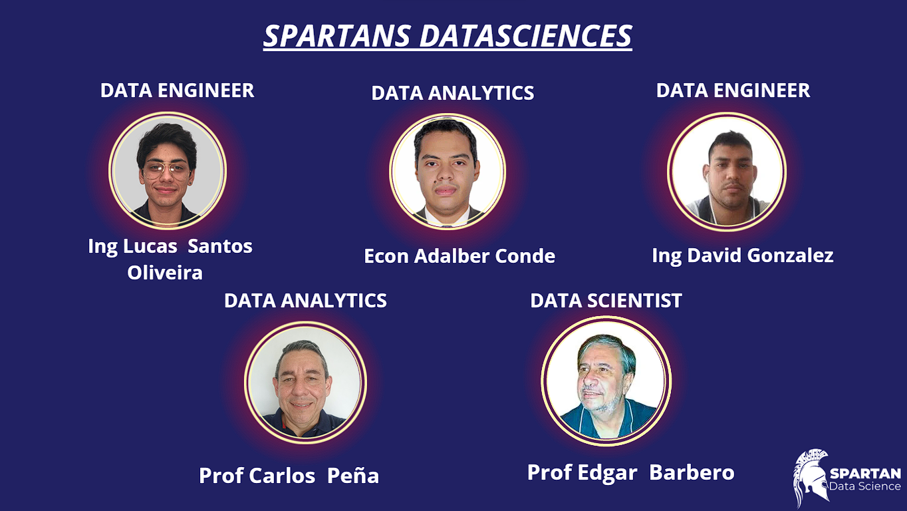
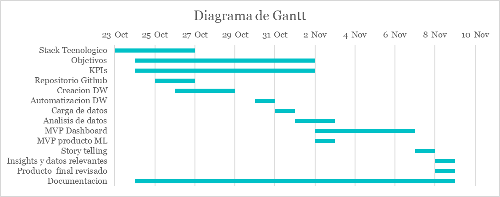

<h1> Proyecto: RestoTrends </h1>

 

## **Tabla de contenidos**
- [¿Quienes Somos?](#Quienes-Somos)
- [Nuestro Equipo](#Nuestro-Equipo)
- [Descripción del Proyecto](#Descripción-del-proyecto)
- [Objetivos](#Objetivos)
- [Alcance](#Alcance)
- [Stack tecnológico](#Stack-Tecnológico)
- [Metodología de trabajo](#Metodología-de-Trabajo)
- [Diagrama de Gantt](#Diagrama-de-Gantt)
- [Información y recursos](#Información-y-Recursos)
   - [Documento_dossier del Proyecto](#Documento-Dossier-del-Proyecto)
   - [Documentación de sprints y avances del Proyecto](#Documentación-de-Sprint-y-Avances-del-Proyecto)
   - [Datos del Proyecto](#Datos-del-Proyecto)
   - [Notebooks de ETLs](#Notebooks-de-ETLs)
   - [Diccionario de datos](#Diccionario-de-datos)
   - [Notebooks de EDAs](#Notebooks-de-EDAs)
- [Automatización](#Automatización)
   - [Archivos complementarios a la automatización](#Archivos-complementarios-a-la-automatización)
- [Tableros informativos](#Tableros-informativos)
- [¡Descrubre nuestro asistente!](#¡Descrubre-nuestro-asistente!)
   - [Código de BobTrends (Bot de Telegram)](#Código-de-BobTrends)
- [Video del Proyecto](#Video-del-proyecto)

## **¿Quienes Somos?**

Somos **Spartan Data Science**, un equipo  de profesionales dinámico y creativo, con la capacidad de entender las  necesidades de los  clientes y transformar  sus requerimientos en soluciones  agiles y pertinentes para el  mejoramiento  continuo de  las  empresas. 

Nos destacamos por dar la respuesta adecuada  y oportuna  a  las  inquietudes de empresarios e inversores para  la  toma de deciciones informada y con el sustento pertinente.
 

## **Nuestro equipo**

## **Descripción del Proyecto**

En nuestra calidad de especialistas en análisis de datos, examinamos minuciosamente la información recopilada en sitios de reseñas como Yelp y Google Maps con el propósito de identificar patrones y tendencias provenientes de los comentarios de los usuarios para entender profundamente sus experiencias, necesidades y expectativas respecto a diversos servicios y negocios. Este ejercicio de evaluación de datos nos permite ofrecer consejos y sugerencias detalladas tanto a potenciales inversores interesados en este proyecto, como a empresarios existentes, siendo un recurso crucial para la toma de decisiones informadas y la mejora de la reputación y la percepción de los negocios en la mente de los clientes. Este propósito se logra mediante la implementación de métodos sofisticados de análisis de sentimientos y aprendizaje automático para ofrecer a nuestros clientes un sistema de recomendaciones eficaz y fácil de usar, así como información valiosa relacionada con tendencias y sentimientos de consumidores para la toma de decisiones informada por parte de inversionistas. 
 

## **Objetivos**

Desarrollar una plataforma comprensiva que se encargue de reunir, limpiar y presentar datos organizados y claros de comentarios de usuarios. Esto se logra mediante la realización de un análisis exploratorio, la creación de un sistema de recomendaciones fundamentado en el análisis de sentimientos, un modelo predictivo para evaluar el crecimiento empresarial y un panel interactivo para la visualización y exploración detallada de los resultados.
 

## **Alcance**

Realizar un desarrollo inicial a nivel local con solo una muestra de los datos disponibles con el propósito de desarrollar las funcionalidades necesarias y poder disponibilizar el producto final en un sistema en la nube que pueda manejar la totalidad de los datos en una etapa posterior.  De la misma forma se construirá un tablero interactivo que pueda manejar cualquier tamaño de datos y genere la información relevante que finalmente va a consumir el cliente final
 

## **Stack tecnológico**

 

## **Metodología de trabajo**

Utilizaremos un método de trabajo ágil con enfoque en la metodología SCRUM, en donde dividiremos y asignaremos las actividades a realizar, guiados por un diagrama de Gantt y manteniendo un seguimiento durante todas las etapas del proyecto.

 

## **Diagrama de Gantt**

 

## **Información y Recursos**

 

### Documento dossier del Proyecto

Al hacer <a href="https://github.com/Hotcer/Spartans-Project/blob/master/DOCs/PROYECTO.pdf">click en este enlace</a> será conducido al documento que proporciona recursos, detalle, metodología, resultados esperados, entre otros detalles explicados con mayor precisión.

 

### Documentación de sprint y avances del Proyecto 

Al hacer <a href="https://github.com/Hotcer/Spartans-Project/blob/master/DOCs/Sprint1.pdf">click en este enlace</a> será conducido al documento perteneciente al Sprint 1.

 

### Datos-del-Proyecto

Al hacer <a href="https://drive.google.com/drive/folders/1WH_Am48dCQ9ebB47dBqM_fEugYKVahf0?usp=drive_link">click en este enlace</a> será conducido a la carpeta que contiene los conjuntos de datos utilizados en el proyecto, lo que te permitirá acceder y explorar los datos subyacentes.

 

### Notebooks-de-ETLs

Al hacer <a href="https://github.com/Hotcer/Spartans-Project/tree/master/ETLs">click en este enlace</a> será conducido a la carpeta que contiene los Notebooks del proceso de Extracción, Transformación y Carga (ETL) de datos.

 

### Diccionario de datos

Al hacer [click en el siguiente enlace](https://github.com/Hotcer/Spartans-Project/blob/master/Diccionario.md) será conducido al archivo donde se encuentra el diccionario de las tablas que usamos.

 

### Notebooks de EDAs

Al hacer <a href="https://github.com/Hotcer/Spartans-Project/tree/master/EDAs">click en este enlace</a> será conducido a la carpeta que contiene los Notebooks del proceso de análisis exploratorio de datos (EDA).

 

## Automatización
[`explicación_pipline_Yelp.md`](https://github.com/Hotcer/Spartans-Project/blob/master/explicaci%C3%B3n_pipline_Yelp.md), es un archivo readme del pipline de actualización. Haciendo click en el archivo van a poder entender todo lo que hicimos en el proyecto para que nuestros datos se mantengan actualizados de manera automatica.

 

### Archivos complementarios a la automatización
* [`pipes`](https://github.com/Hotcer/Spartans-Project/tree/master/pipes): Es una carpeta que contiene los **scripts** que se ejecuta para nuestra automatización de extracción de datos, limpieza, transformaciones y actualizaciones.
* [`video_explicativo`](https://drive.google.com/file/d/1lrnQAMO9Aa_GPigfIoAYQdb_JjyEDBwJ/view?usp=drive_link): Este es un video que explicará como trabaja nuestro modelo.

 

## Tableros informativos 

Nuestros tableros informativos (Dashboards) están dirigidos a ofrecer información relevante para dueños de negocios y para futuros inversores.

Para dueños de negocios ofrecemos información relevante con Key Performance Indicators (KPI´s) obtenidos desde las recomendaciones de los usuarios, con indicadores claves que le dan al empresario un diagnóstico certero de cómo ven y sienten los clientes su negocio.

Para inversores, se les ofrece unas métricas con información relevante relacionada con negocios con buen sentimiento en los clientes, pero con votación media en el rating de calificaciones, lo que genera oportunidades de inversión a precios menores, porque son negocios que necesitan un impulso y un nuevo aire para posicionarse adecuadamente. 

Adicionalmente, a los inversores les ofrecemos la  información de los Googler´s y Yelper´s más  activos  en la población donde están interesados en explorar negocios, como estrategia de valoración de negocio o mercadeo  futuro.

Al hacer <a href="https://github.com/Hotcer/Spartans-Project/blob/master/InvestTrend%20(Dashboard%20Power%20Bi)/InvestTrends.pbix">click en este enlace</a> será conducido al archivo que contiene el  Dashboard  en mención. Está desarrollado en "Power bi" por lo que solo puede ser descargado desde este sitio para  posteriormente ser abierto en esa aplicación.

## ¡Descrubre nuestro asistente! 

¡Descubre el nuevo asistente gastronómico que revolucionará tus experiencias culinarias! 🍽✨

🌟 Presentamos el Bot de Recomendación de Restaurantes en Telegram: [BotTrends](https://t.me/BotTrends_bot) 🌟

🍕 ¿Antojo de pizza?¿O quizás un lugar acogedor para una cita especial? Deja que nuestro bot te guíe hacia las mejores opciones de la ciudad.

✨ Características destacadas:
- Recomendaciones personalizadas basadas en tus preferencias. Puedes elegir de las ciudades más importante de Estados Unidos.
- Reseñas honestas y actualizadas de la comunidad gastronómica.
- ¡Descubre gemas culinarias que ni siquiera sabías que existían!

🔥 ¡Convierte cada comida en una experiencia extraordinaria con BotTrends! Únete ahora: [BotTrends](https://t.me/BotTrends_bot) 🔥

¡Prepárate para explorar un mundo de sabores con solo un clic! 🌍🔍 #BotTrends #RecomendacionesGastronómicas #ExploreFlavors

 

### Código de BobTrends

Al hacer <a href="https://github.com/Hotcer/Spartans-Project/tree/master/BotTrends%20(bot)">click en este enlace</a> será conducido a la carpeta que contiene el archivo con el código en Python del bot de Telegram®.

 

## Video del Proyecto
[Ver el video en YouTube](https://youtu.be/1wgP55bSDxM)
